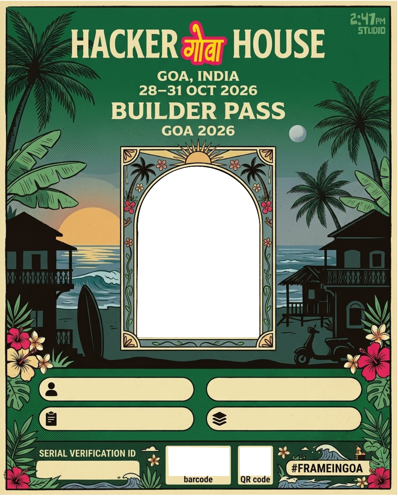

# 🌴 Hacker House Goa 2026 — Builder Card Generator

> A custom, template-driven Builder Card Editor & Generator built with **React**, **TypeScript**, **Vite**, **Tailwind CSS / Vanilla CSS Tokens**, and **HTML5 Canvas**.



---

## ⚡ Overview

The **HHG 2026 Builder Card Generator** allows attendees and community members of **Hacker House Goa 2026** (held 28–31 Oct 2026) to create personalized 1080×1350 high-resolution Builder Identity Passes.

Users upload and crop their photos, enter their builder profile information, select from custom designed card templates, adjust photo/text/graphic positions interactively in real time, and download crisp PNG passes ready for sharing on **X (formerly Twitter)** and LinkedIn.

---

## ✨ Features

- **📸 Interactive Photo Upload & Cropping**: Instant image upload with live drag-and-crop capabilities, zoom sliders, and support for high-res images.
- **🎨 Multi-Template System**: Choose between 5+ custom-designed Hacker House Goa 2026 card templates.
- **🖼 Single Canonical Canvas Engine (`cardRenderer.ts`)**:
  - The live editor preview and final 1080×1350 PNG generator use the **exact same Canvas rendering pipeline**.
  - **Zero layout shifts** between editor preview and final exported PNG.
  - High DPI / Retina screen backing-store support.
- **🔀 Builder Title Reshuffler**: Generates dynamic 2-word builder titles (`SIGNAL ARCHITECT`, `RUNTIME OPERATOR`, etc.) with 1-click reshuffle controls.
- **🎲 Randomized Unique Serial IDs**: Timestamp-seeded serial codes (`HH26-XXXX-XXXX`) generated fresh for every pass.
- **📊 Synchronized Barcode & Vector QR Code**: Barcode and QR code graphics dynamically reflect the exact unique serial code in solid vector black.
- **🛠 Dev Mode Tools (`?dev=1`)**:
  - Live side-by-side **Compare Render** tool (Canvas Preview vs. 1080×1350 Native Export Output).
  - Clean **JSON Export & Import** modal for template position calibration.

---

## 🛠 Tech Stack

- **Framework**: React 18 / Vite 8 / TypeScript
- **Styling**: Hallmark Design System (OKLCH Color Tokens, Space Grotesk Typography, Tactile Neo-Brutalist aesthetics)
- **Animation**: Motion (`motion/react`)
- **Rendering**: HTML5 2D Canvas API + Custom Web Font Preloader (`document.fonts.load`)

---

## 🚀 Getting Started

### Prerequisites

- Node.js (v18+) or [Bun](https://bun.sh)

### Installation

```bash
# Clone repository
git clone https://github.com/Lakshyakumar266/hackerHouse-goa-task-1.git
cd hackerHouse-goa-task-1

# Install dependencies
bun install
# or: npm install
```

### Development Server

```bash
bun run dev
# or: npm run dev
```

Open [http://localhost:5173](http://localhost:5173) in your browser.

### Production Build

```bash
bun run build
# or: npm run build
```

---

## 📂 Project Structure

```
task-1/
├── public/
│   └── templates/          # Template PNG assets (templete_1 to templete_5)
├── src/
│   ├── assets/             # Brand logos (Hacker House, Goa Hindi, 2:47 PM Studio)
│   ├── components/
│   │   ├── Hero.tsx         # Landing hero & footer with socials
│   │   ├── PhotoUpload.tsx  # Photo crop tool
│   │   ├── BuilderForm.tsx  # Identity input form
│   │   ├── CardEditor.tsx   # Interactive Canvas-driven editor & hitboxes
│   │   ├── CardPreview.tsx  # Final card display
│   │   └── SharePanel.tsx   # Download & X share controls
│   ├── hooks/
│   │   └── useCardGenerator.ts # Generator hook using canonical renderer
│   ├── lib/
│   │   ├── cardRenderer.ts  # Canonical 1080x1350 Canvas rendering engine
│   │   ├── builderTitle.ts  # Title generator & serial code generator
│   │   └── templateConfig.ts# Template JSON coordinate configurations
│   ├── App.tsx              # Multi-stage application workflow shell
│   └── index.css            # Hallmark design system tokens & utilities
├── README.md
└── package.json
```

---

## 👤 Author

Made with ⚡ by **Lakshya**

- **X / Twitter**: [@Lakshyakumar266](https://x.com/Lakshyakumar266)
- **GitHub**: [@Lakshyakumar266](https://github.com/Lakshyakumar266)

---

## 📄 License

MIT License © 2026 [Lakshya](https://github.com/Lakshyakumar266)
